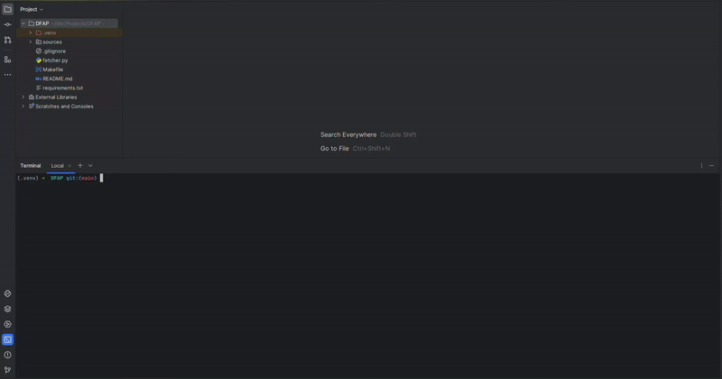

# WDFAP: Web Data Fetcher And Preparer

**WDFAP** is a Python tool that enables you to **fetch**, **clean**, **prepare**, **label**, and **upload** articles
from web sources in
various
formats such as `csv`, `json`, `xlsx`, and `parquet`. It provides you with a versatile way to access, analyze, and
manage
diverse sets of data.

> [!NOTE]
>
> Please note that currently, only the fetching feature is available.

## Installation

To get started with the **WDFAP**, follow these simple steps:

1. Clone this repository to your local machine:

```zsh
git clone git@github.com:IsmaelMousa/WDFAP.git
```

2. Navigate to the **WDFAP** directory:

```zsh
cd WDFAP
```

3. Setup virtual environment:

```zsh
python3 -m venv .venv
```

4. Activate the virtual environment:

```zsh
source .venv/bin/activate
```

5. Setup **WDFAP**:

```zsh
make setup
```

## Usage

The **WDFAP** provides a user-friendly interface for fetching articles. For now, you can choose to fetch articles from
**Wikipedia**, **Google News**, or both simultaneously. The fetched data is stored in the `data/` directory in different
formats
for easy access and analysis.

1. Run the **WDFAP**:

```zsh
make start
```

2. After that the terminal will ask you a few questions, here is an example with results:

<div align="center">



</div>

## Modules

Here is a summary for the purpose of each major module or component in **WDFAP**:

<details>
  <summary>Click for more information:</summary>

|       Module       | Purpose                                                                                                                                                                                                                                    |
|:------------------:|--------------------------------------------------------------------------------------------------------------------------------------------------------------------------------------------------------------------------------------------|
|      `tools`       | Provides utility functions and scripts for orchestrating the fetching, cleaning, labeling, and uploading of data from various sources. Initially includes a script for user interaction to fetch articles from Web Sources asynchronously. |
|     `sources`      | Provides modules for fetching articles asynchronously from different sources like Google News & Wikipedia.                                                                                                                                 |
|       `data`       | Storage Where fetched articles are stored in various formats such as `csv`, `json`, `xlsx` and `parquet`.                                                                                                                                  |
|      `errors`      | Prepares and customizes exceptions for handling specific issues.                                                                                                                                                                           |
|      `utils`       | Houses common utilities/logic utilized throughout the project.                                                                                                                                                                             |
|     `configs`      | Contains main configurations for both development and production stages.                                                                                                                                                                   |
|     `setup.py`     | Configures the project metadata and dependencies for streamlined installation.                                                                                                                                                             |
|     `main.py`      | Serves as the entry point, initiating the project.                                                                                                                                                                                         |
|     `Makefile`     | Provides commands for installing dependencies and running the application.                                                                                                                                                                 |
| `requierments.txt` | Lists all the required dependencies for running the application.                                                                                                                                                                           |

</details>

## Dependencies

Here is an overview of the dependencies/packages used in the **WDFAP** along with their respective usage:

<details>
  <summary>Click for more information:</summary>

|    Dependency    | Usage                                                                                                                                                          |
|:----------------:|----------------------------------------------------------------------------------------------------------------------------------------------------------------|
| `beautifulsoup4` | Offers powerful tools for parsing and navigating HTML documents, simplifying the extraction of structured data from web pages.                                 |
|   `newspaper`    | Simplifies the extraction and curation of articles from online sources, streamlining the process of gathering news content.                                    |
|   `feedparser`   | Parses RSS and Atom feeds, enabling extraction of syndicated content from websites and blogs.                                                                  |
|    `asyncio`     | Facilitates asynchronous I/O operations, allowing for concurrent execution of tasks without blocking the event loop.                                           |
|    `aiohttp`     | Provides asynchronous HTTP client/server functionality for asyncio, enabling efficient handling of web requests and responses.                                 |
|     `pandas`     | Provides high-performance data manipulation and analysis tools, ideal for working with structured datasets.                                                    |
|      `tqdm`      | Enhances loops with progress bars, providing visual feedback on the progress of iterative tasks, improving user experience and productivity.                   |
|    `openpyxl`    | Facilitates reading from and writing to Excel files, enabling manipulation of spreadsheet data with Python.                                                    |
|    `pyarrow`     | Provides tools for working with Apache Arrow data, an in-memory columnar data format, offering efficient data interchange between different systems.           |
|  `fastparquet`   | Offers efficient reading and writing of Parquet files, a columnar storage format optimized for analytics workloads, enabling high-performance data processing. |

</details>

## Sources

For now the available web sources are:

- [Wikipedia](https://en.wikipedia.org/wiki/)
- [Google News](https://news.google.com)

## Contributing

We appreciate your interest in contributing to our project! Your contributions help us improve and grow.

Please check [Contributing](/CONTRIBUTING.md) for the contribution guidelines, and make sure to read [CODE_OF_CONDUCT](/CODE_OF_CONDUCT.md) document.